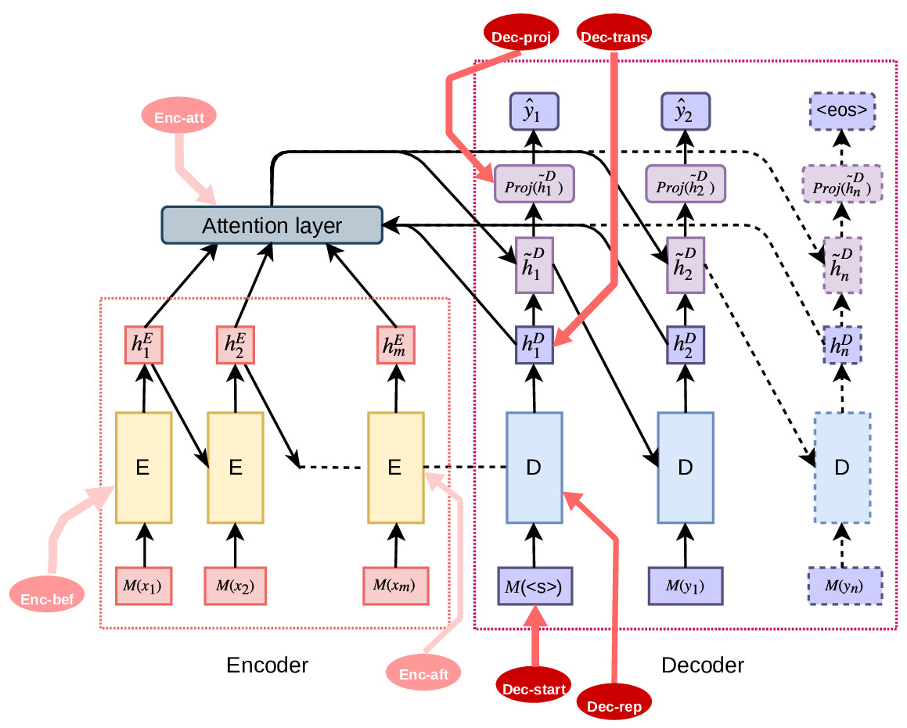

# Dialogue Generation with Expressed Emotions

**CODE CLEANING JUST STARTED, IT WILL BE DONE BY 12th MARCH 2019.**

This repo contains the implementation of the two papers:

[*Automatic dialogue generation with expressed emotions*](http://www.aclweb.org/anthology/N18-2008)


[*Generating Responses Expressing Emotion in an Open-domain Dialogue System*](https://conversations2018.files.wordpress.com/2018/10/conversations_2018_paper_9_preprint2.pdf)

The second paper is basically an extension of the first, it shows four more approaches to express specified emotions. 

The following figure shows an overview of all the 7 models. 



## Instructions
The code is originally written in PyTorch0.3 and Python3.6

This project is heavily relying on emotion classifier. In this code ,we use a very simple Bi-LSTM model. The performance would very but not too much depending what kinda of text classifier you are using.

CBET dataset can be accessed through this [link](https://github.com/chenyangh/CBET-dataset). It is balanced in single labeled emotions and preprocessed. 

To replicate the results in the paper, you need to follow the following instructions:

1.  Firstly, train an emotion classifier using CBET dataset.  


2. Download jiwei's dataset as in his [github page](), I made a code that converts his dataset from token IDs to actual tokens.


```
python jiwei_dataset.py
```

3. 


## Citation
If you find our work is helpful, please consider citing one of the following papers.

```
@inproceedings{huang2018automatic,
  title={Automatic dialogue generation with expressed emotions},
  author={Huang, Chenyang and Zaiane, Osmar and Trabelsi, Amine and Dziri, Nouha},
  booktitle={Proceedings of the 2018 Conference of the North American Chapter of the Association for Computational Linguistics: Human Language Technologies, Volume 2 (Short Papers)},
  volume={2},
  pages={49--54},
  year={2018}
}
``` 


```
@article{huang2018generating,
  title={Generating Responses Expressing Emotion in an Open-domain Dialogue System},
  author={Huang, Chenyang and Za{\"\i}ane, Osmar R},
  journal={arXiv preprint arXiv:1811.10990},
  year={2018}
}
```

